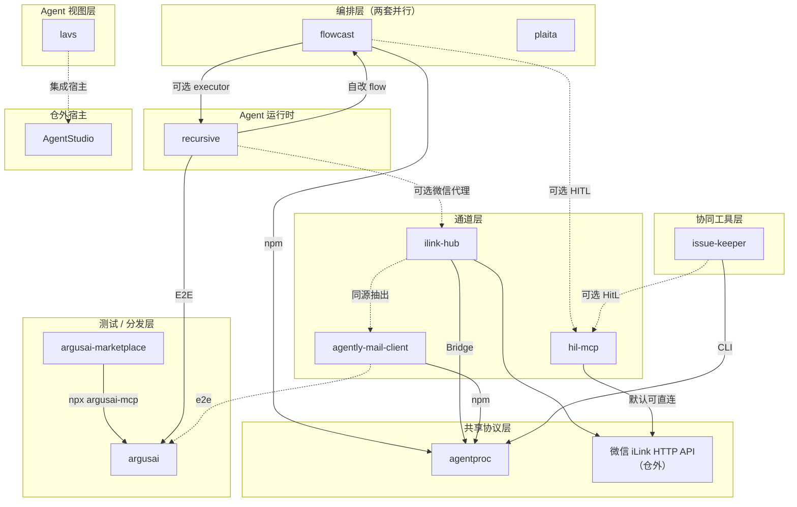
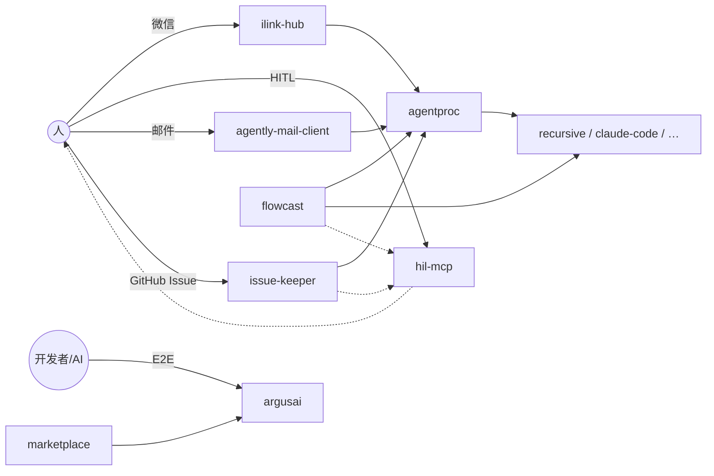

# infra4agent 架构文档

> 最后更新：2026-07-16  
> 维护者：jeffkit  
> 配置源：根目录 `mona.yaml`（子仓清单以该文件为准）

本文记录逻辑大仓 **infra4agent** 对各子项目的定位认知、分层架构与依赖关系，供人类与 AI 助手导航。  
细节以各子仓 `README.md` / `AGENTS.md` / 源码为准；本文只描述**仓与仓之间**的结构。

---

## 1. 大仓是什么

infra4agent 是 **AI Agent 基础设施逻辑大仓**（monarbor 管理）：子仓各自独立 git 仓库，大仓根只追踪 `mona.yaml`、`.gitignore` 与文档，不合并代码树。

目标：把「协议 → 通道 → 运行时 → 编排 → 测试 → 协同」相关项目收拢到同一导航面，方便 AI 与人类理解谁依赖谁、该改哪一仓。

常用命令：

```bash
monarbor list
monarbor status
monarbor clone -b prod
monarbor pull
```

---

## 2. 分层架构

从下到上：共享协议 → 通道 → Agent 运行时 → 编排 → 视图 → 测试/分发 → 协同工具。



### 读图要点

1. **agentproc 是横切共享协议**：通道、编排、协同多条链路在进程边界上汇聚到它（stdin turn / stdout NDJSON）。
2. **flowcast 与 plaita 是并行编排栈**：产品叙事接近，本大仓内**无互依赖**。
3. **通道三件套**（微信 hub / HITL / 邮件）入口不同，常接到 AgentProc 或 iLink。
4. **lavs** 在本大仓内几乎悬空；真实宿主在仓外 **AgentStudio**。
5. **argusai** 横切做 E2E；**marketplace** 只做 Claude Code 侧分发。

---

## 3. 子项目一览

| 路径 | 名称 | 一句话定位 | 角色层 |
|------|------|------------|--------|
| `agentproc` | AgentProc | 桥接消息平台与 Agent CLI 的最小进程协议 + SDK + Profile Hub | 共享协议 |
| `ilink-hub` | iLink Hub | 微信 ClawBot iLink 多路复用与 Bridge | 通道（微信） |
| `hil-mcp` | hitl-mcp | 关键操作前经微信/企微向人确认的 HITL MCP | 通道（人机确认） |
| `agently-mail-client` | Agently Mail | 邮箱 → AgentProc → 自动回复 | 通道（邮件） |
| `recursive` | Recursive | Rust ReAct 编码 Agent（HTTP/MCP/TUI/微信） | Agent 运行时 |
| `flowcast` | Flowcast | Node workflow：断点续跑、HITL、多 CLI、L3 codegen（曾用名 flowx） | 编排（Agent/CLI 向） |
| `plaita` | Plaita | Python 逻辑编排运行时（JSON/@flow；曾用路径 loki/pyloki） | 编排（流程引擎向） |
| `lavs` | LAVS | Agent 结构化 UI 协议与 TS/Py SDK | Agent 视图 |
| `argusai` | ArgusAI | YAML 驱动 Docker E2E + `argusai-mcp` | 测试 |
| `argusai-marketplace` | ArgusAI Marketplace | Claude Code Plugin，拉起 `argusai-mcp` | 测试分发 |
| `issue-keeper` | Issue Keeper | 监控 issue → screener → agentproc → 写回评论 | 协同工具 |

---

## 4. 依赖关系

关系强度分三档：**硬依赖**（包/核心 CLI）、**协议或可选调用**、**文档/同生态**。

### 4.1 硬依赖

| 边 | 说明 | 典型证据 |
|----|------|----------|
| `argusai-marketplace → argusai` | 分发并 `npx argusai-mcp` | marketplace `.mcp.json` |
| `flowcast → agentproc` | npm 依赖 + executor adapter | `flowcast/package.json` |
| `agently-mail-client → agentproc` | npm 依赖 + dispatcher | `package.json` / `src/dispatcher.js` |
| `issue-keeper → agentproc` | 主链路 spawn CLI（非 Python 包依赖） | `issue_keeper/profile.py` |
| `recursive/.dev/flows → flowcast` | 自改/开发 flow | `.dev/flows/package.json` |
| `recursive/e2e → argusai` | E2E plugins（常为 file: 布局依赖） | `e2e/plugins/package.json` |

### 4.2 协议 / 可选集成

| 边 | 说明 |
|----|------|
| `flowcast → recursive` | 可选 executor（直连 CLI；recursive 未必走 agentproc EXECUTORS） |
| `recursive → ilink-hub` | 微信 `base_url` / `WEIXIN_BASE_URL` 指向 hub |
| `ilink-hub → agentproc` | Bridge / profile 协议（NDJSON） |
| `ilink-hub ↔ agently-mail-client` | 邮件能力从 hub 抽出；双通道共享 AgentProc 思路 |
| `flowcast → hil-mcp` | HITL 后端可走 MCP（历史配置键 `@wecom-hil`） |
| `issue-keeper → hil-mcp` | keeper 巡检 HitL（可选 MCP） |
| `agently-mail-client → argusai` | 可选 `e2e.yaml` |
| `hil-mcp → iLink API` | 默认可直连腾讯端点；语义上可兼容 hub 代理 |

### 4.3 文档级 / 无兄弟硬边

| 项目 | 说明 |
|------|------|
| `plaita` | 与 flowcast 无代码互依赖；自有 approval 节点，非 hil-mcp |
| `lavs` | 本大仓无引用；集成在 AgentStudio |
| `argusai → hil-mcp` | 路线图提及，非当前硬依赖 |
| `argusai → recursive` | 兼容断言插件（部分已 deprecated） |

### 4.4 谁驱动谁（场景向）



---

## 5. 两个关键设计分叉

### 5.1 编排双轨：flowcast vs plaita

| | flowcast | plaita |
|--|----------|--------|
| 语言/形态 | Node ESM 库 + CLI | Python 运行时 + DSL |
| 擅长 | 多 CLI/Agent、自改沙箱、质量门、L3 codegen | JSON/@flow 逻辑流、插件 Node、分布式续执 |
| 与 agentproc | 硬依赖 | 本大仓内无直接边 |
| 关系 | **并行**，非上下游 | 同上 |

改「让 Agent 跑任务流 / 自迭代」优先看 flowcast；改「平台式逻辑编排引擎」优先看 plaita。

### 5.2 通道三件套

| 通道 | 项目 | 汇聚点 |
|------|------|--------|
| 微信多路 | ilink-hub | iLink + AgentProc Bridge |
| 人确认 | hil-mcp | 微信 ClawBot / 企微 AI Bot（MCP） |
| 邮件 | agently-mail-client | AgentProc |

不要假设「开了微信就自动有 HITL」或「邮件走 hub」——配置上各自独立，产品上可组合。

---

## 6. 典型链路（心智模型）

1. **微信聊 Agent**  
   用户 → iLink → `ilink-hub` → AgentProc Bridge → Profile（如 recursive/claude-code）→ 回复。

2. **编排驱动多 CLI**  
   `flowcast orchestrate` / flow → executor（agentproc 或直连 recursive）→ 可选 HITL（hil-mcp）。

3. **邮件 Agent**  
   收件 → `agently-mail-client` → agentproc profile → 回信。

4. **Issue 自动应答**  
   GitHub/internal → `issue-keeper` screener → agentproc → 评论写回；可选 HitL。

5. **E2E 验收**  
   业务仓或 recursive e2e → `argusai`（YAML + Docker）；Claude 侧可经 marketplace 装插件。

6. **可视化 Agent 面**  
   Agent 暴露 LAVS manifest →（仓外）AgentStudio / 前端渲染。

---

## 7. 边界：什么不在本大仓

| 外部 | 与本仓关系 |
|------|------------|
| 微信 iLink 官方 API | hil-mcp / ilink-hub 的上游 |
| AgentStudio | lavs 的主要集成宿主 |
| 各业务项目仓库 | 消费 flowcast/argusai/plaita 等，不纳入本仓 |
| npm/PyPI 上的已发布包 | 子仓发布物；大仓 clone 的是源码仓 |

---

## 8. 已知张力 / 待确认

以下不影响导航主图，但改代码前宜核对：

1. **hil-mcp 是否生产推荐经 ilink-hub 代理**（代码默认可直连官方 iLink）。
2. **flowcast HITL 配置名**（历史 `@wecom-hil`）与当前 `hitl-mcp` 包名是否文档已对齐。
3. **ilink-hub 内旧 `.flowx` / `@force-lab/flowx` 引用** 与现包名 `flowcast` 是否需迁移。
4. **ilink-hub email-bridge vs agently-mail-client** 哪边为正式发布源。
5. **agentproc 版本分裂**（如 flowcast 与 mail-client 锁定版本差较大）的兼容边界。
6. **recursive e2e 的 `file:…/infra4agent/argusai`** 依赖大仓相对布局，单独 clone 可能失效。
7. **plaita 与 flowcast 是否计划互通**——当前是缺口，不是隐藏依赖。

---

## 9. 文档维护

- 子仓增删：先改 `mona.yaml` 与 `.gitignore`，再更新本文 §3 / §4。
- 依赖变化：以包声明与运行时调用为准更新 §4；纯 README 提及放 §4.3。
- 各子仓内部架构：写在子仓自己的 `ARCHITECTURE.md` / `AGENTS.md`，本文不重复。

相关文件：

| 文件 | 说明 |
|------|------|
| `README.md` | 人类向总览与快速开始 |
| `AGENTS.md` | AI 入仓导航入口 |
| `mona.yaml` | 子仓清单与描述 |
| `docs/DOC_CODE_MAP.md` | 文档 ↔ 代码映射 |
| 各子仓 `AGENTS.md` | 子仓内 AI 导航 |
