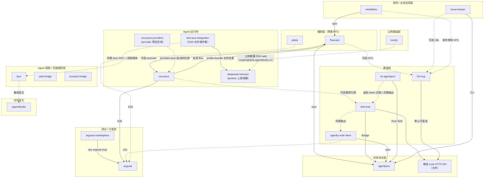
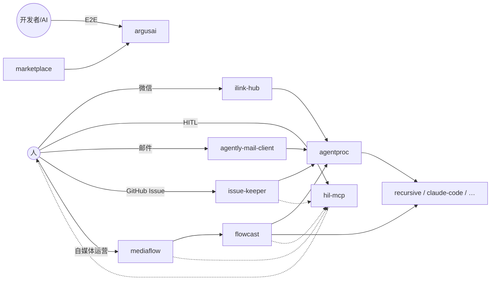

# infra4agent 架构文档

> 最后更新：2026-09-28（登记 monarbor 为第 21 子仓并加固其嵌套扫描；清理 im-agentproc 重复条目；修正 ui-tasks 发布状态）  
> 维护者：jeffkit  
> 配置源：根目录 `mona.yaml`（子仓清单以该文件为准）

本文记录逻辑大仓 **infra4agent** 对各子项目的定位认知、分层架构与依赖关系，供人类与 AI 助手导航。  
细节以各子仓 `README.md` / `AGENTS.md` / 源码为准；本文只描述**仓与仓之间**的结构。

---

## 1. 大仓是什么

infra4agent 是 **AI Agent 基础设施逻辑大仓**（monarbor 管理）：子仓各自独立 git 仓库，大仓根只追踪 `mona.yaml`、`.gitignore` 与文档，不合并代码树。

目标：把「协议 → 通道 → 运行时 → 编排 → 测试 → 协同」相关项目收拢到同一导航面，方便 AI 与人类理解谁依赖谁、该改哪一仓。

常用命令：

```bash
monarbor list
monarbor status
monarbor clone -b prod
monarbor pull
```

---

## 2. 分层架构

从下到上：共享协议 → 通道 → Agent 运行时 → 编排 → 视图/页面操控 → 测试/分发 → 协同工具。


```mermaid
flowchart TB
  subgraph collab["协同 / 业务应用层"]
    IK["issue-keeper"]
    MF["mediaflow"]
  end

  subgraph test["测试 / 分发层"]
    AM["argusai-marketplace"]
    AA["argusai"]
    AM -->|npx argusai-mcp| AA
  end

  subgraph ui["Agent 视图 / 页面操控层"]
    LAVS["lavs"]
    WB["web-bridge"]
    BB["browser-bridge"]
  end

  subgraph orch["编排层（两套并行）"]
    FC["flowcast"]
    PL["plaita"]
  end

  subgraph runtime["Agent 运行时"]
    REC["recursive"]
    RCP["recursive-providers<br/>（provider 预设目录）"]
    DSH["deepseek-harness<br/>（pristine 上游镜像）"]
    DSLI["dsh-lavs-integration<br/>（DSH 仓外插件集）"]
  end

  subgraph channel["通道层"]
    IH["ilink-hub"]
    IMAP["im-agentproc"]
    HITL["hil-mcp"]
    MAIL["agently-mail-client"]
  end

  subgraph tunnel["公网隧道层"]
    TN["tunely"]
  end

  subgraph shared["共享协议层"]
    AP["agentproc"]
    ILINK["微信 iLink HTTP API<br/>（仓外）"]
  end

  subgraph external["仓外宿主"]
    AS["AgentStudio"]
  end

  FC -->|npm| AP
  FC -->|可选 executor| REC
  RCP -.->|providers.json 启动时拉取| REC
  FC -.->|可选 HITL| HITL
  REC -->|自改 flow| FC
  REC -.->|可选微信代理| IH
  REC -->|E2E| AA
  IH -->|Bridge| AP
  IH --> ILINK
  IH -.->|同源抽出| MAIL
  MAIL -->|npm| AP
  IMAP -->|Rust SDK| AP
  IMAP -.->|虚拟 token 后端 / 同源抽出| IH
  HITL -->|默认可直连| ILINK
  IK -->|CLI| AP
  IK -.->|可选 HitL| HITL
  MAIL -.->|e2e| AA
  PL -.->|E2E| AA
  MF -->|npm| FC
  MF -.->|发布审核 HITL| HITL
  DSLI -->|profile+bundle 仓外挂载| DSH
  DSLI -.->|同源 /lavs RPC + 视图服务| LAVS
  TN -.->|公网暴露 DSH web（crypto@dsht.agentstudio.cc）| DSH
  LAVS -.->|集成宿主| AS
```

### 读图要点

1. **agentproc 是横切共享协议**：通道、编排、协同多条链路在进程边界上汇聚到它（stdin turn / stdout NDJSON）。
2. **flowcast 与 plaita 是并行编排栈**：产品叙事接近，本大仓内**无互依赖**。
3. **通道三件套**（微信 hub / HITL / 邮件）入口不同，常接到 AgentProc 或 iLink。
4. **lavs / web-bridge / browser-bridge 同属「Agent ↔ UI」叙事但路径不同**：lavs 是结构化 View 协议（CLI-first + 独立轻量 Host，v1.1 起以 content-type 为主抽象，支持 pinned/dispatch 双宿主模式）；web-bridge 是注入式 DOM/a11y 操控（Electron/Tauri console），面向本机 Agent 操控桌面 WebView；browser-bridge 是浏览器扩展 + gateway，面向**远程** Agent 经 MCP 操控本地真实浏览器（Chrome/Edge MV3），协议形状与 web-bridge 一致（`{id,method,params}` + `@eN` 引用）。三者互补，互不依赖。
5. **argusai** 横切做 E2E；**marketplace** 只做 Claude Code 侧分发。
6. **im-agentproc 是 agentproc-native 的 IM 桥接运行时**：从 ilink-hub 的 `src/bridge` 抽离，作为虚拟 token 后端连 Hub，把入站 IM 消息路由到 agentproc profile（P0 exec）；当前经 `Transport` trait 已接入 iLink/微信、Telegram、WeCom（智能机器人 WebSocket）、飞书（WebSocket）、Discord（Gateway WebSocket）。Agent 出站投递（文本 + 媒体）通过 im-agentproc 内置的 MCP server（`send_text` / `send_image` / `send_file` / `send_voice`），hub profile 进程通过标准 `mcp_servers` 块连入。
7. **mediaflow 是本大仓唯一的业务应用**：内容生产走 flowcast 编排（创意→文案→配图/视频→发布），发布与互动闭环经 hil-mcp 微信确认；公众号走官方 API 全自动、小红书走 browser-use 半自动、视频走 MiniMax（后三者为仓外能力）。
8. **deepseek-harness 的集成已转纯插件形态**（[ADR-2026-09-06](./ADR-2026-09-06-dsh-pure-plugin-form.md)）：fork 分支封存；`dsh-lavs-integration` 公开子仓经官方 profile/bundle/dsh.client 机制仓外挂载 LAVS host 适配、原生右侧栏视图 tab（**纯项目作用域**：视图只认会话工作目录下 `.lavs/bundles/`，fs.watch 热更新），零上游文件改动；**已发 npm 裸名五包**——`dsh-bundle-lavs@0.1.1` + `dsh-plugin-{lavs-host,ui-lavs,ui-tasks,lavs-cli}@0.1.0`，`dsh plugin add` 包名直装（web-app 务必用与运行时同版本的显式版本——上游 dsh-web-app 的 latest 标签停在 0.0.x 会被兼容门拒）；headless `--resume` runner 已退役（上游 ≥0.1.6 原生 `--session-id` adopt + `--json` 取代）；agent 工具面收敛为 `lavs` CLI + Skill，常驻工具改 opt-in；ui-tasks（Tasks tab）已移植到 0.1.7-rc.2 正式 API 并**随 `dsh-bundle-lavs@0.1.1` 发布**。
9. **tunely 是唯一的公网隧道**：内网客户端主动拨出 WebSocket（不开入站端口），字节级透传 TCP 流量——HTTP/WebSocket/SSE 全部原样穿过（Host/Origin 不改写）。Python 服务端（API 管理面 + `tcp_listen_port` 裸 TCP 出口两种形态）+ Python/TypeScript/Rust 三客户端（Rust 单二进制零运行时）。当前部署：crypto 上 9080 出口固定转发 `dsh` 隧道，暴露本机 DSH web。
10. **monarbor 既是管理本仓的工具，也是本仓子仓**：它按 `mona.yaml` 管理全部子仓，因此自身也登记进来（`monarbor/`，第 21 个子仓）就地迭代——工具缺陷与被它管理的仓同仓可见，避免"工具问题只能靠 `pip install` 的外部版本解决"。本机经 pipx 从该路径安装。近期加固：嵌套大仓递归发现不跟随符号链接、剪枝依赖/构建目录、深度上限兜底，修掉 `monarbor list` 在含 pnpm/vendor 软链环仓库上的 ENAMETOOLONG 崩溃（[MONARBOR_NOTES.md](./MONARBOR_NOTES.md)）。

---

## 3. 子项目一览

| 路径 | 名称 | 一句话定位 | 角色层 |
|------|------|------------|--------|
| `agentproc` | AgentProc | 桥接消息平台与 Agent CLI 的最小进程协议 + SDK + Profile Hub | 共享协议 |
| `ilink-hub` | iLink Hub | 微信 ClawBot iLink 多路复用与 Bridge | 通道（微信） |
| `im-agentproc` | IM-AgentProc | 从 ilink-hub 抽离的 IM→AgentProc 桥接运行时（iLink/微信、Telegram、WeCom、飞书、Discord → agentproc profile） | 通道（IM 桥接） |
| `hil-mcp` | hitl-mcp | 关键操作前经微信/企微向人确认的 HITL MCP | 通道（人机确认） |
| `agently-mail-client` | Agently Mail | 邮箱 → AgentProc → 自动回复 | 通道（邮件） |
| `recursive` | Recursive | Rust ReAct 编码 Agent（HTTP/MCP/TUI/微信） | Agent 运行时 |
| `recursive-providers` | Recursive Providers | recursive 的 LLM provider 预设目录：providers.json 单一事实源（模型/端点/上下文窗口/定价），agent 启动时自动拉取 | Agent 运行时（配套数据） |
| `flowcast` | Flowcast | Node workflow：断点续跑、HITL、多 CLI、L3 codegen（曾用名 flowx） | 编排（Agent/CLI 向） |
| `plaita` | Plaita | Python 逻辑编排运行时（JSON/@flow；曾用路径 loki/pyloki） | 编排（流程引擎向） |
| `lavs` | LAVS | CLI-first 结构化 View 协议：content-type 为主抽象，view bundle 可跨 Agent 复用，配独立轻量 Host 渲染；含 TS/Py SDK | Agent 视图 |
| `web-bridge` | web-bridge | 注入式 DOM/a11y 桥：MCP/CLI 操控桌面 WebView 页面 | 页面操控 |
| `browser-bridge` | browser-bridge | MV3 扩展（Chromium+Firefox）+ MCP gateway：远程 Agent 操控本地真实浏览器；serve/mcp/relay 三部署形态，多浏览器 browserId 路由 | 页面操控 |
| `mediaflow` | MediaFlow | KONG 自媒体运营：Flowcast 编排创意→文案→配图/视频→审核→发布 | 业务应用 |
| `tunely` | Tunely | WebSocket 反向代理隧道：内网服务经公网 HTTPS 可达；Py 服务端 + Py/TS/Rust 客户端（Rust 单二进制） | 公网隧道 |
| `argusai` | ArgusAI | YAML 驱动 Docker E2E + `argusai-mcp` | 测试 |
| `argusai-marketplace` | ArgusAI Marketplace | Claude Code Plugin，拉起 `argusai-mcp` | 测试分发 |
| `issue-keeper` | Issue Keeper | 监控 issue → screener → agentproc → 写回评论 | 协同工具 |
| `deepseek-harness` | DeepSeek Harness | 上游 pristine 镜像（master 跟随 upstream，不改源码）；历史 fork 改造封存于 feat/headless-resume，集成物在 `dsh-lavs-integration` 纯插件形态 | Agent 运行时 |
| `dsh-lavs-integration` | dsh-lavs-integration | DSH 仓外插件集：LAVS host 适配 + 原生右栏视图 tab（纯项目作用域）+ Tasks tab + `lavs` CLI/Skill，经官方 profile+bundle 挂载，零上游改动 | Agent 运行时（DSH 插件） |
| `plaita-nodes` | plaita-nodes | plaita 通用节点集（22 节点）：Agent/LLM/决策原子（agentrun/llm/decision）· 流程控制（gate/rate_limit/report/hitl/hitl_await）· 出害口（github_comment/git_publish/notify/writefile/parse_json）· 凭据化连接器（api_request/generic_webhook/sql_query/email_send + IM webhook×4） | 编排插件（节点层） |
| `monarbor` | Monarbor | **本大仓自身的命令行工具**：一个 `mona.yaml` 管全部子仓（list/status/clone/pull/exec/checkout/add）；嵌套大仓递归发现已加固（不跟软链、剪枝依赖目录、深度上限） | 大仓工具（管理本仓自身） |

---

## 4. 依赖关系

关系强度分三档：**硬依赖**（包/核心 CLI）、**协议或可选调用**、**文档/同生态**。

### 4.1 硬依赖

| 边 | 说明 | 典型证据 |
|----|------|----------|
| `argusai-marketplace → argusai` | 分发并 `npx argusai-mcp` | marketplace `.mcp.json` |
| `flowcast → agentproc` | npm 依赖 + executor adapter | `flowcast/package.json` |
| `agently-mail-client → agentproc` | npm 依赖 + dispatcher | `package.json` / `src/dispatcher.js` |
| `issue-keeper → agentproc` | 主链路 spawn CLI（非 Python 包依赖） | `issue_keeper/profile.py` |
| `recursive/.dev/flows → flowcast` | 自改/开发 flow | `.dev/flows/package.json` |
| `recursive/e2e → argusai` | E2E plugins（常为 file: 布局依赖） | `e2e/plugins/package.json` |
| `im-agentproc → agentproc` | Rust crate 硬依赖（crates.io 0.11，非 git rev pin） | `im-agentproc/Cargo.toml` |
| `mediaflow → flowcast` | npm 依赖 `file:../flowcast`；所有 flow 经 `flowcast run` 驱动 | `mediaflow/package.json` |
| `dsh-lavs-integration → deepseek-harness` | `@deepseek-ai/dsh-*` peer 锚 `^0.1.7-rc.2`（dsh 兼容门安装前预检），类型为根 devDeps 精确锁 npm 包；已发 npm（裸名五包：`dsh-bundle-lavs@0.1.1` + `dsh-plugin-{lavs-host,ui-lavs,ui-tasks,lavs-cli}@0.1.0`，`dsh plugin add` 包名直装），开发期 tarball/`file:` 挂载 | `bundles/lavs/cordis.patch.yml` |
| `plaita-nodes → plaita` | Python 包依赖（editable，plaita 0.5.0 未发 PyPI） | `plaita-nodes/pyproject.toml` |
| `plaita-nodes → agentproc` | Python SDK 依赖（`runner.run` + `EXECUTORS` 注册 recursive-direct） | `plaita-nodes/src/plaita_nodes/agent_run.py` |
| `mediaflow → plaita-nodes` | 试点迁移（ADR-2026-08-27）：content-daily 经 plaita + 节点集运行 | `mediaflow/plaita_flows/` |

### 4.2 协议 / 可选集成

| 边 | 说明 |
|----|------|
| `flowcast → recursive` | 可选 executor（直连 CLI；recursive 未必走 agentproc EXECUTORS） |
| `recursive → ilink-hub` | 微信 `base_url` / `WEIXIN_BASE_URL` 指向 hub |
| `recursive → recursive-providers` | 启动时经 raw URL 拉取 providers.json（本地缓存超 7 天刷新）；纯运行期数据源，无构建期依赖 |
| `ilink-hub → agentproc` | Bridge / profile 协议（NDJSON） |
| `ilink-hub ↔ agently-mail-client` | 邮件能力从 hub 抽出；双通道共享 AgentProc 思路 |
| `flowcast → hil-mcp` | HITL 后端可走 MCP（历史配置键 `@wecom-hil`） |
| `issue-keeper → hil-mcp` | keeper 巡检 HitL（可选 MCP） |
| `agently-mail-client → argusai` | 可选 `e2e.yaml` |
| `plaita → argusai` | console 全系统 E2E：`plaita-console/e2e.yaml`（16 suite 231 用例：API 面 / 鉴权 RBAC / dry-run 含 onlyNode / engine 级多进程含 cancel 终态与 switch 分支 / 引擎可靠性（双 worker + DLQ）/ 版本管理与删除联动 / 契约面 HMAC / 调度边界 / 注册表审计 / 控制台 UI；混沌矩阵：Redis 瞬断 / console 重启 / worker 重启 / DLQ）+ `scripts/e2e-{run,gate,chaos-*.sh}` 经 mcp2cli/argusai-mcp 驱动；CI 经 `.github/workflows/console-e2e.yml` 路径过滤接入。工具链依赖，非包依赖 |
| `hil-mcp → iLink API` | 默认可直连腾讯端点；语义上可兼容 hub 代理 |
| `mediaflow → hil-mcp` | 发布 / 互动闭环经微信 HITL 确认（config 驱动，非 npm 依赖） |
| `im-agentproc ↔ ilink-hub` | 从 hub `src/bridge` 抽离；运行期作为虚拟 token 后端连 Hub 跑 profile | `im-agentproc/src/bridge/transport.rs` |
| `im-agentproc → agentproc` | 每条入站 IM 消息触发一次 agentproc profile（P0 exec 协议） | `im-agentproc/src/bin/im-agentproc.rs` |
| `issue-keeper screener → plaita-console` | screener `backend=flow`：拉 console 上已发布 `issue-screener` flow 定义（semver 最高，X-Admin-API-Key，TTL+stale 缓存+本地凭据回退），本地 DecisionNode 执行；判定配置的版本与质量由 plaita-ai supervisor 自迭代管线管护 | `issue_keeper/screener.py` |
| `dsh-lavs-integration → lavs` | 同源协议集成：lavs-host serve `/lavs-view/<bundle>/` 视图文件与 `/lavs` Connection RPC（list/call → lavs-runtime ScriptExecutor），视图消费 view 协议但**不依赖 @lavs/* npm 包** | `packages/lavs-host` |

### 4.3 文档级 / 无兄弟硬边

| 项目 | 说明 |
|------|------|
| `plaita` | 与 flowcast 无代码互依赖；自有 approval 节点，非 hil-mcp |
| `lavs` | 大仓内无 npm 互依赖：AgentStudio 侧直接集成；DSH 侧经 `dsh-lavs-integration` 同源 HTTP/RPC 集成（无 @lavs/* 包依赖） |
| `web-bridge` | 本大仓无兄弟硬依赖；经 MCP/HTTP 被任意 Agent 消费 |
| `browser-bridge` | 本大仓无兄弟硬依赖（协议形状对齐 web-bridge，无代码依赖）；经 MCP（streamable HTTP/stdio）被任意 Agent 消费 |
| `argusai → hil-mcp` | 路线图提及，非当前硬依赖 |
| `argusai → recursive` | 兼容断言插件（部分已 deprecated） |

### 4.4 谁驱动谁（场景向）


```mermaid
flowchart LR
  User((人))

  User -->|微信| IH[ilink-hub]
  User -->|HITL| HITL[hil-mcp]
  User -->|邮件| MAIL[agently-mail-client]
  User -->|GitHub Issue| IK[issue-keeper]
  User -->|自媒体运营| MF[mediaflow]

  IH --> AP[agentproc]
  MAIL --> AP
  IK --> AP
  AP --> Agents[recursive / claude-code / …]
  FC[flowcast] --> AP
  FC --> Agents
  MF --> FC
  MF -.-> HITL

  HITL -.-> User
  FC -.-> HITL
  IK -.-> HITL

  Dev((开发者/AI)) -->|E2E| AA[argusai]
  AM[marketplace] --> AA
```

---

## 5. 两个关键设计分叉

### 5.1 编排双轨：flowcast vs plaita

| | flowcast | plaita |
|--|----------|--------|
| 语言/形态 | Node ESM 库 + CLI | Python 运行时 + DSL |
| 擅长 | 多 CLI/Agent、自改沙箱、质量门、L3 codegen | JSON/@flow 逻辑流、插件 Node、分布式续执 |
| 与 agentproc | 硬依赖 | 本大仓内无直接边 |
| 关系 | **并行**，非上下游 | 同上 |

改「让 Agent 跑任务流 / 自迭代」优先看 flowcast；改「平台式逻辑编排引擎」优先看 plaita。

### 5.2 通道三件套

| 通道 | 项目 | 汇聚点 |
|------|------|--------|
| 微信多路 | ilink-hub | iLink + AgentProc Bridge |
| IM→AgentProc 桥接 | im-agentproc | agentproc profile（P0 exec）；连 iLink Hub 作虚拟 token 后端 |
| 人确认 | hil-mcp | 微信 iLink / 企微 AI Bot / Telegram / Discord / 飞书（MCP） |
| 邮件 | agently-mail-client | AgentProc |

不要假设「开了微信就自动有 HITL」或「邮件走 hub」——配置上各自独立，产品上可组合。

---

## 6. 典型链路（心智模型）

1. **微信聊 Agent**  
   用户 → iLink → `ilink-hub` → AgentProc Bridge → Profile（如 recursive/claude-code）→ 回复。

2. **编排驱动多 CLI**  
   `flowcast orchestrate` / flow → executor（agentproc 或直连 recursive）→ 可选 HITL（hil-mcp）。

3. **邮件 Agent**  
   收件 → `agently-mail-client` → agentproc profile → 回信。

4. **Issue 自动应答**  
   GitHub/internal → `issue-keeper` screener → agentproc → 评论写回；可选 HitL。

5. **E2E 验收**  
   业务仓或 recursive e2e → `argusai`（YAML + Docker）；Claude 侧可经 marketplace 装插件。

6. **可视化 Agent 面（CLI-first 模式）**  
   Agent 目录有 `lavs.json` → `lavs discover` 列出可用 bundle → `lavs view [contentType]` 启动本地 Host + 浏览器 tab → Agent 通过 `lavs call <endpoint>` 操作数据 → View 通过 SSE 自动刷新。亦可配合 AgentStudio 等支持 LAVS 的宿主（pinned / dispatch 模式）。

7. **操控桌面应用 WebView**  
   `web-bridge serve` → 粘贴 inject.js 到 Electron/Tauri DevTools → Agent 经 MCP/CLI 定位与点击输入。

8. **远程 Agent 操控本地浏览器**  
   本地 Chrome/Edge 装 `browser-bridge` 扩展（options 填 gateway 地址 + token）→ 扩展出站 WebSocket 连远程机器上的 `browser-bridge-gateway serve` → 远程 Agent 经 MCP（streamable HTTP `/mcp`）调 browser_* 工具 → snapshot 得 `@eN` → 点击/输入/截图。同机 agent 亦可 `gateway mcp`（stdio）拉起。

9. **IM 经 AgentProc 桥接**  
   用户 → iLink → `ilink-hub` → `im-agentproc`（虚拟 token 后端）→ agentproc profile（claude-code/codex…）→ 回复；与链路 1 的区别是桥接层走 agentproc-native 的 profile 协议，而非 hub 自带的通用 YAML CLI 后端。

10. **自媒体内容流水线**  
   `mediaflow` 声明 flow → `flowcast` 编排执行（创意→文案→配图/视频）→ 发布/互动经 hil-mcp 微信确认 → 公众号官方 API 全自动发布 / 小红书 browser-use 半自动。

---

## 7. 边界：什么不在本大仓

| 外部 | 与本仓关系 |
|------|------------|
| 微信 iLink 官方 API | hil-mcp / ilink-hub 的上游 |
| AgentStudio | lavs 的主要集成宿主 |
| 各业务项目仓库 | 消费 flowcast/argusai/plaita 等，不纳入本仓 |
| npm/PyPI 上的已发布包 | 子仓发布物；大仓 clone 的是源码仓 |

---

## 8. 已知张力 / 待确认

以下不影响导航主图，但改代码前宜核对：

1. **hil-mcp 是否生产推荐经 ilink-hub 代理**（代码默认可直连官方 iLink）。
2. **flowcast HITL 配置名**（历史 `@wecom-hil`）与当前 `hitl-mcp` 包名是否文档已对齐。
3. **ilink-hub 内旧 `.flowx` / `@force-lab/flowx` 引用** 与现包名 `flowcast` 是否需迁移。
4. **ilink-hub email-bridge vs agently-mail-client** 哪边为正式发布源。
5. **agentproc 版本分裂**（如 flowcast 与 mail-client 锁定版本差较大）的兼容边界。
6. **recursive e2e 的 `file:…/infra4agent/argusai`** 依赖大仓相对布局，单独 clone 可能失效。
7. **plaita 与 flowcast 是否计划互通**——当前是缺口，不是隐藏依赖。2026-08-27 已有决议方向：编排内核收敛到 plaita、执行层经 agentproc，见 [ADR-2026-08-27](./ADR-2026-08-27-orchestration-converge-on-plaita.md)（mediaflow 全量迁移已完成）。
8. **web-bridge 与 lavs** 叙事已明确分工：lavs 主张「Agent 产生结构化数据 → 渲染对应 view bundle」；web-bridge 主张「Agent 注入操控现有 Web 页面 DOM」。两者互补，不合并。lavs v1.1 新增 dispatch 模式（按 content-type 分发）和独立轻量 Host（`lavs view` 命令），不再依赖 AgentStudio 作唯一宿主。
9. **ilink-hub 的 `ilink-hub-bridge` 与新建 `im-agentproc` 的关系**——后者从前者 `src/bridge` 抽离，是 agentproc-native 的 IM→本地 CLI 桥接运行时（跑 agentproc profile，遵循 P0 exec）；前者仍保留通用 YAML 驱动的本地 CLI 后端。需确认哪边为 IM→AgentProc 的正式入口（提案 `bridge-as-multi-im-runtime` 指向 im-agentproc 为后继）。
10. **DSH×LAVS 集成已转纯插件形态**（[ADR-2026-09-06](./ADR-2026-09-06-dsh-pure-plugin-form.md)）：`dsh-lavs-integration` 子仓经官方 profile/bundle 机制仓外挂载，零上游文件改动；8/16 的 fork 集成与 ADR-2026-08-16 的"暂不整合"决议一并由该 ADR 取代。fork 分支封存留档，上游 PR 通道仍关闭（`submit-pr.sh` 作废）。
11. **web-bridge 与 browser-bridge 分工**：web-bridge 主张「本机 Agent 注入操控 Electron/Tauri 等桌面 WebView」；browser-bridge 主张「远程/本机 Agent 经浏览器扩展 + gateway 操控真实浏览器（Chrome/Edge）」。协议形状有意一致（`{id,method,params}` + `@eN`）降低心智成本，但两者无代码依赖，无合并计划。
12. **大仓工具 monarbor 的 `list` 崩溃已修复**（曾为已知缺陷，非配置问题）：`list_repos` 曾无条件调用 `find_nested_monorepos` 且不传 `exclude_paths`，而该函数既不剪枝 `node_modules` 又跟随符号链接；deepseek-harness 的 `vendor/cordis` 与 `vendor/include` 互为软链构成目录环，递归到路径超长（`OSError: [Errno 63] File name too long`）。0.3.0 与 0.4.0 均复现。**修复已落在子仓 `monarbor`**（不跟软链 + 剪枝依赖/构建目录 + 深度上限 + `list_repos` 传精确排除集），并补 8 个回归测试；根因剖析、影响面矩阵与复现见 [MONARBOR_NOTES.md](./MONARBOR_NOTES.md)。

---

## 9. 文档维护

- 子仓增删：先改 `mona.yaml` 与 `.gitignore`，再更新本文 §3 / §4。
- 依赖变化：以包声明与运行时调用为准更新 §4；纯 README 提及放 §4.3。
- 各子仓内部架构：写在子仓自己的 `ARCHITECTURE.md` / `AGENTS.md`，本文不重复。

相关文件：

| 文件 | 说明 |
|------|------|
| `README.md` | 人类向总览与快速开始 |
| `AGENTS.md` | AI 入仓导航入口 |
| `mona.yaml` | 子仓清单与描述 |
| `docs/DOC_CODE_MAP.md` | 文档 ↔ 代码映射 |
| `docs/MONARBOR_NOTES.md` | monarbor 工具缺陷（`list` 崩溃）与可用命令矩阵 |
| `docs/ADR-2026-08-27-orchestration-converge-on-plaita.md` | 编排收敛到 plaita 的决议 |
| `docs/ADR-2026-09-06-dsh-pure-plugin-form.md` | DSH×LAVS 转纯插件形态的决议 |
| 各子仓 `AGENTS.md` | 子仓内 AI 导航 |
